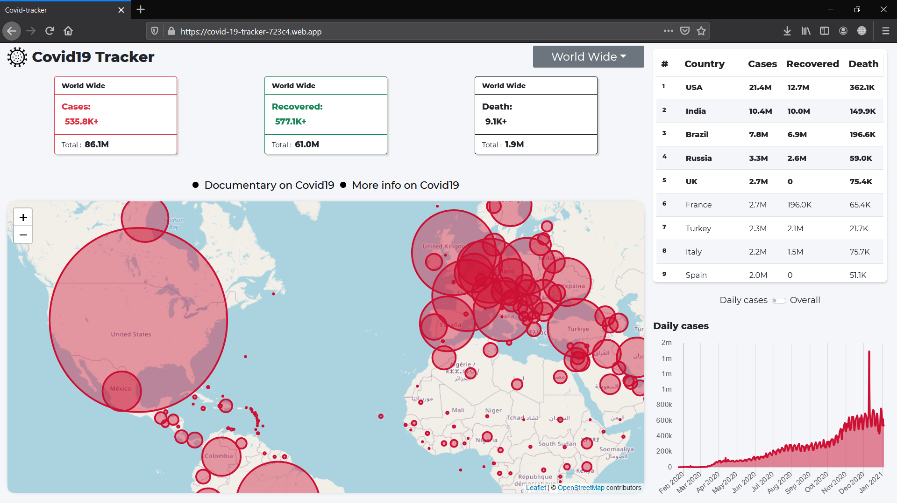
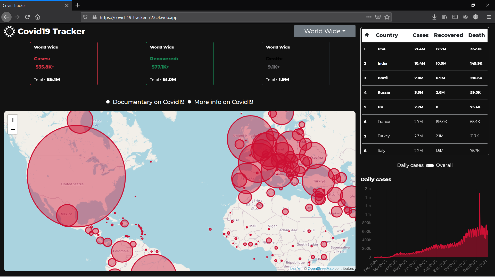

# Covid-19-App

Api used - [disease.sh](https://disease.sh/) \
Deployed App - [Link](https://covid-19-tracker-723c4.web.app/)

### What this app shows
+ Show data worldwide 
+ Show data Country wise
+ Show data on Daily bases and overall

### Dark Mode
+ Dark mode is also available and is done through **react context api** (a state management tool) and can be activated by clicking on the virus.svg icon on the top left corner
 

### Modules used 
+ Bootstrap 5 (via cdn) --> Bootstrap used in this project is in **alpha** phase so can be changed in future 
  + *Css* in head 
      <link
      href="https://cdn.jsdelivr.net/npm/bootstrap@5.0.0-beta1/dist/css/bootstrap.min.css"
      rel="stylesheet"
      integrity="sha384-giJF6kkoqNQ00vy+HMDP7azOuL0xtbfIcaT9wjKHr8RbDVddVHyTfAAsrekwKmP1"
      crossorigin="anonymous"
     />
  + *Script* in Body tag 
      
+ AOS (javascript animation on scroll module)
  + *CSS* in Head tag 
     <link rel="stylesheet" href="https://unpkg.com/aos@next/dist/aos.css" />
  + *Script* in Body tag   
     
     
+ React Router Dom --> for getting multipage functionality
  + npm i react-router-dom
+ React-Leaflet --> for the map used in the project 
  + npm i react-leaflet
+ react-chartjs-2 --> for data visualization
  + npm install react-chartjs-2 chart.js --> chart.js is dependency for react-chartjs-2
  
